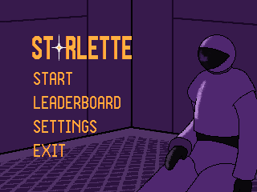
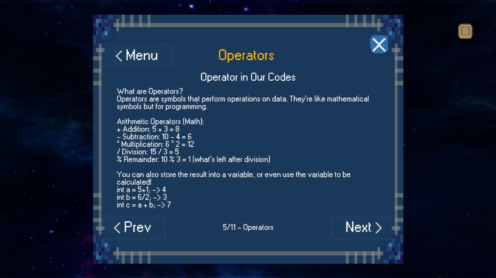
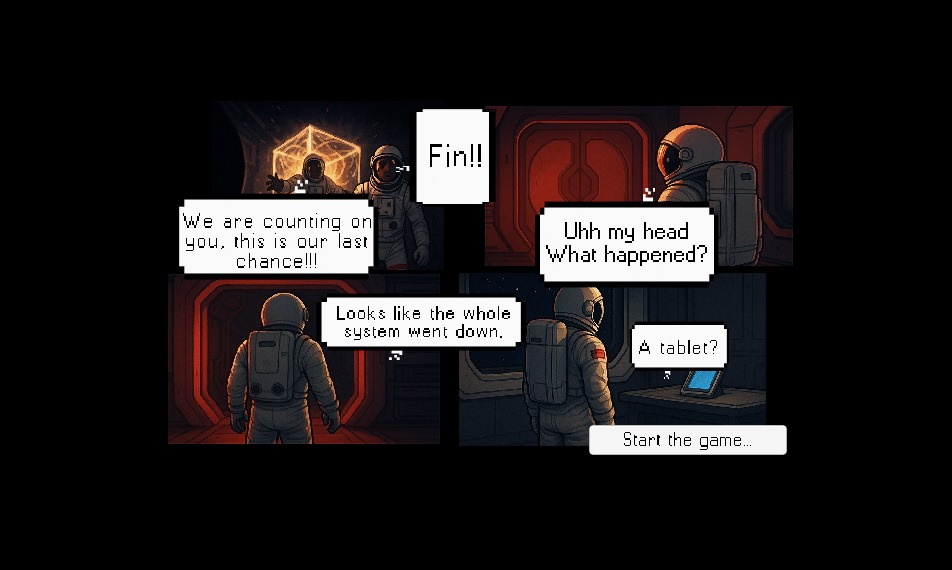

<div align="center">
  <svg width="100%" height="200" viewBox="0 0 800 200" xmlns="http://www.w3.org/2000/svg">
    <!-- Space background -->
    <defs>
      <radialGradient id="spaceGradient" cx="50%" cy="50%" r="50%">
        <stop offset="0%" style="stop-color:#1a1a2e;stop-opacity:1" />
        <stop offset="50%" style="stop-color:#16213e;stop-opacity:1" />
        <stop offset="100%" style="stop-color:#0f0f23;stop-opacity:1" />
      </radialGradient>
      
      <!-- Shooting star animation -->
      <g id="shootingStar">
        <path d="M0,0 L20,0 L15,2 L20,0 L15,-2 Z" fill="white" opacity="0.9"/>
        <circle cx="0" cy="0" r="1.5" fill="#ffff99"/>
      </g>
    </defs>
    
    <!-- Background -->
    <rect width="100%" height="100%" fill="url(#spaceGradient)"/>
    
    <!-- Stars -->
    <circle cx="100" cy="30" r="1" fill="white" opacity="0.8"/>
    <circle cx="200" cy="50" r="1.5" fill="#ffff99" opacity="0.9"/>
    <circle cx="300" cy="25" r="1" fill="white" opacity="0.7"/>
    <circle cx="450" cy="40" r="1" fill="#ffff99" opacity="0.8"/>
    <circle cx="600" cy="35" r="1.5" fill="white" opacity="0.9"/>
    <circle cx="750" cy="20" r="1" fill="#ffff99" opacity="0.7"/>
    <circle cx="150" cy="80" r="1" fill="white" opacity="0.6"/>
    <circle cx="350" cy="90" r="1" fill="#ffff99" opacity="0.8"/>
    <circle cx="550" cy="75" r="1.5" fill="white" opacity="0.7"/>
    <circle cx="700" cy="85" r="1" fill="#ffff99" opacity="0.9"/>
    <circle cx="50" cy="120" r="1" fill="white" opacity="0.8"/>
    <circle cx="250" cy="140" r="1" fill="#ffff99" opacity="0.7"/>
    <circle cx="400" cy="130" r="1.5" fill="white" opacity="0.8"/>
    <circle cx="650" cy="125" r="1" fill="#ffff99" opacity="0.6"/>
    <circle cx="120" cy="170" r="1" fill="white" opacity="0.9"/>
    <circle cx="320" cy="180" r="1" fill="#ffff99" opacity="0.8"/>
    <circle cx="520" cy="160" r="1.5" fill="white" opacity="0.7"/>
    <circle cx="720" cy="175" r="1" fill="#ffff99" opacity="0.8"/>
    
    <!-- Shooting stars -->
    <g transform="translate(150,60)">
      <path d="M0,0 L30,0 L25,2 L30,0 L25,-2 Z" fill="white" opacity="0.7"/>
      <circle cx="0" cy="0" r="1.5" fill="#ffff99"/>
      <animateTransform attributeName="transform" type="translate" 
        values="150,60; 250,80; 350,100" dur="3s" repeatCount="indefinite"/>
    </g>
    
    <g transform="translate(500,30)">
      <path d="M0,0 L25,0 L20,1.5 L25,0 L20,-1.5 Z" fill="white" opacity="0.6"/>
      <circle cx="0" cy="0" r="1" fill="#ffff99"/>
      <animateTransform attributeName="transform" type="translate" 
        values="500,30; 600,50; 700,70" dur="4s" repeatCount="indefinite"/>
    </g>
    
    <g transform="translate(80,140)">
      <path d="M0,0 L20,0 L15,1 L20,0 L15,-1 Z" fill="white" opacity="0.8"/>
      <circle cx="0" cy="0" r="1.2" fill="#ffff99"/>
      <animateTransform attributeName="transform" type="translate" 
        values="80,140; 180,160; 280,180" dur="2.5s" repeatCount="indefinite"/>
    </g>
    
    <!-- Title -->
    <text x="400" y="110" text-anchor="middle" fill="white" font-family="Arial, sans-serif" font-size="36" font-weight="bold">
      🌟 Starlette
    </text>
    <text x="400" y="135" text-anchor="middle" fill="#ccc" font-family="Arial, sans-serif" font-size="18">
      An Educational Puzzle Game
    </text>
  </svg>
</div>

---

<div style="background: linear-gradient(135deg, #1a1a2e 0%, #16213e 50%, #0f0f23 100%); padding: 20px; border-radius: 10px; color: white;">

## 🎮 Game Overview

> _"A game you play for fun, but end up learning to code!"_

Starlette places the player inside a mysterious digital lab where the only way out is through solving logic-based puzzles. The catch? Each puzzle represents a fundamental programming concept—like loops, conditionals, variables, and operators—all hidden beneath an intuitive block-based system.

</div>

---

<div style="background: linear-gradient(45deg, #16213e, #1a1a2e); padding: 15px; border-radius: 8px; color: white;">

## 🧩 Features

- 🧠 Logic puzzles that reflect actual programming constructs
- 🧱 Guided block-based coding system (similar to Scratch)
- 🎯 Progressively challenging levels
- 🔐 Account system with Firebase authentication
- 🎨 Clean UI/UX using Unity + React
- 🚀 Educational goals wrapped in fun gameplay

</div>

---

## 🖼️ Screenshots

<div align="center" style="background: linear-gradient(135deg, #0f0f23, #1a1a2e); padding: 20px; border-radius: 10px;">

<p align="center">
  
</p>

<p align="center">
  
</p>

<p align="center">
  
</p>

> 📌 Place your screenshots inside the `/images` directory.

</div>

---

<div style="background: linear-gradient(90deg, #1a1a2e, #16213e, #1a1a2e); padding: 15px; border-radius: 8px; color: white;">

## 🛠️ Built With

- **Unity** – game engine for core game logic and visuals
- **React.js** – frontend interface (if applicable)
- **Express.js / Go / Rust** – backend API (choose one based on your stack)
- **Firebase** – user authentication and cloud data storage
- **Figma / Canva** – UI/UX prototyping

</div>

---

<div style="background: linear-gradient(135deg, #16213e 0%, #0f0f23 100%); padding: 20px; border-radius: 10px; color: white;">

## 🚀 Getting Started

### 📦 Clone the Repository

```bash
git clone https://github.com/yourusername/starlette-game.git
cd starlette-game
```

### 🎮 Or Install the Game:
**[Play Starlette Now!](https://starlette-web-shxg.vercel.app/)** ✨

</div>

---

<div align="center">
  <svg width="100%" height="80" viewBox="0 0 800 80" xmlns="http://www.w3.org/2000/svg">
    <rect width="100%" height="100%" fill="url(#spaceGradient)"/>
    <!-- Bottom stars -->
    <circle cx="100" cy="20" r="1" fill="white" opacity="0.8"/>
    <circle cx="200" cy="40" r="1" fill="#ffff99" opacity="0.7"/>
    <circle cx="300" cy="15" r="1.5" fill="white" opacity="0.9"/>
    <circle cx="400" cy="35" r="1" fill="#ffff99" opacity="0.8"/>
    <circle cx="500" cy="25" r="1" fill="white" opacity="0.7"/>
    <circle cx="600" cy="45" r="1.5" fill="#ffff99" opacity="0.9"/>
    <circle cx="700" cy="20" r="1" fill="white" opacity="0.8"/>
    
    <text x="400" y="50" text-anchor="middle" fill="#ccc" font-family="Arial, sans-serif" font-size="14">
      ⭐ Made with love for aspiring programmers ⭐
    </text>
  </svg>
</div>